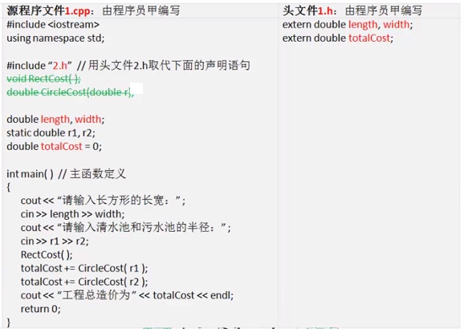

### C++ 源程序的多文件结构
- 多文件结构：外部函数、外部全局变量
- 声明外部函数原型和外部全局变量
	+ 声明外部函数原型 `extern void MakeCake();`
	+ 声明外部全局变量 `extern double length; extern int num;`

- 源程序文件所定义的函数默认都是外部函数，可以被其他文件中的函数调用；
- 源程序文件中所定义的全局变量默认都是外部全局变量，也可以被其他文件中的函数访问；
- 外部函数和外部全局变量被多文件结构中的所有文件共享，其它文件只要经过声明就都可以使用这些函数和全局变量
- 多文件结构中，所有的外部函数不能重名，所有的外部全局变量不能重名，所有的外部函数和全局变量之间也不能重名；
<br/>
- 某些情况下，一个文件中定义的某些函数或全局变量只供文件内部的其它函数使用；
- C++语言可以将这些函数或全局变量定义成静态的，即 静态函数或静态全局变量
- 另外，C++语言还可以定义静态局部变量
 

<br/>

### 头文件





### 编译预处理指令
程序员可以在 C++ 源程序中插入一些 <mark>特殊指令</mark>，其作用是告诉编译器该如何编译本程序。正式编译源程序之前，编译器将预先处理这些特殊指令，它们被称为 <font style="color:red">编译预处理指令</font>。
<br/>

常用的编译预处理指令有：
- <font style="color:red">文件包含指令（#include）</font> 
- <font style="color:red">宏定义指令（#def, #undef）</font> 
- <font style="color:red">条件编译指令</font> 
<br/>

在 C++ 源程序中，编译预处理指令可以写在代码的任意位置，每条指令单独写一行，必须以“#”开头，不加“;”结束符

- 文件包含指令（#include）
	+ 编写 C++ 源程序时，可以使用 **文件包含指令（#include）** 将某个指定文件的内容插入到程序代码的任意位置，通常是用于将某个头文件插入到源程序文件中；
	+ 预处理时，编译器将指定文件的内容插入到该指令所在的代码位置；
	 
- 宏定义指令（#define）
	+ 用一个标志符来表示一段代码文本，这就称为一个<font style="color:red">宏（Macro）</font>，其中的标志符称为<font style="color:red">宏名</font>，所表示的代码文本称为<font style="color:red">宏文本</font> ；
	+ 宏定义指令是一条编译预处理指令。预处理时，编译器将源程序中的所有宏名自动替换回原来的宏文本，这称为 *宏替换* 或 *宏展开* ；
	+ C++ 语言有3种形式的宏：
		- <font style="color:red">无参宏</font> 
		- <font style="color:red">有参宏</font> 
		- <font style="color:red">空宏</font> 
	+ 已定义的宏可以用宏删除指令（<mark>#undef</mark>）删除

- 条件编译指令（#ifdef）


### 几种特殊形式的函数
- 主函数
	+ 一个 C++ 程序必须有且只有1个名为 main 的主函数；
	+ 主函数是程序执行的起点；
	+ 主函数不能被重载；
	+ 主函数的类型应为 int 型，需返回一个 int 型的整数；
	+ 主函数可以定义形参来接收实参数据，也可以省略形参（此时操作系统传来的实参数据将被忽略）；

- 内联函数
	+ 为了实现函数跳转和数据传递，计算机需要执行一些额外的操作。实现相同的功能，单一主函数程序比<mark>主函数+子函数</mark>程序的执行速度要快，即 ~~函数跳转会降低程序的执行效率~~ 。但函数是团队分工协作和代码重用的基础，函数能提高程序的<mark>开发效率</mark>；
	+ **内联函数** （inline function）是一种特殊的函数，它在保证程序开发效率的同时，不降低程序的执行效率；
	+ <mark>内联函数的原理是</mark>：编译源程序时将函数代码直接嵌入到每一个调用语句处，而执行时不再进行函数跳转和数据传递；
	+ **内联函数需是<mark>简单的函数</mark>** 。编译器不能保证程序员所定义或声明的内联函数最终都能按照内联的方式进行编译。如果内联函数的函数体比较复杂，如包含循环语句，编译器将自动按照非内联的方式编译；
	+ 内联函数的执行效率：内联函数只有被多次调用，其执行效率才能体现出来，因此一般只是 *将频繁调用的简单函数* 定义成内联函数；
	```
	#include <iostream>
	using namespace std;
	
	inline double CurrencyConversion(double amount, double rate = 6.1104) {
		return amount/rate;
	}
	
	int main() {
		cout<<CurrencyConversion(500)<<endl;
		cout<<CurrencyConversion(500, 9.7347)<<endl;
		return 0;
	}
	``` 
- 递归函数
	+ 概念：递推与递归
	+ 递推法求解问题的基本思想是，从已知条件出发，根据 **递推公式** 由简到繁，逐步逼近，最终求出问题的解，这种递推方法也称正向递推。正向递推的每一步骤都是已知问题 n-1 的解，递推求问题 n 的解。这些递推步骤是在重复计算递推公式，可使用循环结构来描述递推算法；
	+ 递归法是程序设计中一种基于<font style="color:red">函数嵌套调用</font>原理求解问题的方法。递归法求解问题的过程分2步完成：
		1. 按照递推公式（递归公式）由繁到简，将求问题 n 的解 *降阶* 求问题 n-1 的解，直到满足已知条件（递归终结条件）不能降阶为止，这个过程称 逆向递推；
		2. 函数 *逐级返回* 结果，最终求出问题的解，这儿过程称为 **回归** ；
	+ 递归函数的执行过程


		- 计算机在执行函数调用语句跳转到被调用函数时，为其形参及函数体中定义的局部变量分配内存，建立被调用函数的 **栈帧** ；
		- 函数可以<font style="color:red">嵌套调用</font>。每增加一级函数调用，栈帧就增加一个。每退出以及函数调用，栈帧就减少一个；
		- 计算机执行递归函数的过程就是递归函数<font style="color:red">不断嵌套调用自身、不断建立新栈帧</font>的过程，即<font style="color:green">逆向递推</font>的过程；
		- 当递归终结条件成立时停止调用，开始<font style="color:red">逐级返回</font>结果，退出递归函数并依次释放栈帧，这就是回归的过程；
		- 
		- 
- 系统函数
C++ 语言预先编写了很多常用的函数，提供给广大程序员使用，这些函数被称为 **系统函数** 。
<br/>
C++ 语言是在 C 语言基础上发展而来的
- C 语言是结构化程序设计语言，系统函数是其重要的附属组成部分；
- 标准 C 库
	+ 输入/输出函数
	+ 数学函数
	+ 字符串处理函数
	+ 动态内存分配函数
	+ ……
	+ 使用系统函数之前，需要用文件包含指令引入相应的头文件；
- C++ 标准库（继承了标准 C 库）
	+ C++ 语言全盘继承了 C 语言的语法规则，同时也全盘继承了 C 语言的标准C库
	+ C++ 标准库新增了一些系统函数，更多的是新增了面向对象程序设计的系统类库
	+ 编写 C++ 程序，可以继续使用原来的标准C库，也可以使用新的 C++ 标准库
	+ 经常使用的 cin, cout 输入/输出语句实际上就是 C++ 标准库预先定义好的对象。cin 是 C++ 标准库中定义的一个标准输入流对象，而 cout 则是一个标准输出流对象。使用时需要包含相应头文件“iostream”，还需要声明其命名空间“std”
	```
	#include <iostream>
	using namespace std;
	``` 
	+ C++ 语言是在 C 基础上发展而来的，可以在很大程度上替代 C 语言，如——
		- 用 cin, cout 输入/输出流对象，代替原来的输入/输出函数
		- 用字符串类string，代替原来的字符数组和字符串处理函数
		- 用 new, delete 这2个运算符，取代原来的动态内存分配函数
		- ……
	+ 

### 命名空间
C++ 语言用命名空间来区分同名函数，防止出现调用冲突

- 在命名空间中定义函数和全局变量
```
namespace Eno
{
	int x, y;
	void fun1() {...}
	void fun2() {...}
}
``` 
- 访问命名空间中的函数和全局变量
	+ 方式1：
	```
	Eno::x = 10;
	Eno::fun2();
	``` 
	+ 方式2：
	```
	// 先单独声明各标志符的命名空间
	using Eno::x;
	using Eno::y;
	using Eno::fun1;
	using Eno::fun2;
	
	// 再通过标志符访问
	x = 20;
	fun2();
	``` 
	+ 方式3：
	```
	// 先统一声明命名空间里的所有标志符
	using namespace Eno;
	
	// 再通过标志符访问
	x = 20;
	y = 10;
	fun2();
	``` 
<br/>

**枚举类型** 
C++ 语言可以将值域可枚举的数据定义成新的数据类型，这些数据类型被统称为<font style="color:red">枚举类型</font>，值域中的每个取值称为一个<font style="color:red">枚举元素</font>。
<br/>

<br/>
```
// 定义枚举类型 Weekday
enum  Weekday {sun, mon, tue, wed, thu, fri, sat}; 
``` 
或
```
enum Weekday {sun = 7, mon = 1, tue = 2, wed = 3, thu = 4, fri, sat};
``` 

```
#include <iostream>
using namespace std;

enum Weekday {sun, mon, tue, wed, thu, fri, sat};

int main() {
	enum Weekday x; // 定义Weekday枚举变量
	x = mon; // 为 x 赋值，mon 是枚举常量；枚举变量不能直接用整数赋值
	
	cout<<x<<endl;
	return 0;
}
``` 

### 自定义类型
类型定义 typedef
```
// 为基本数据类型重新命名一个别名
typedef unsigned char AGE;
AGE x; // 等价于：unsigned char x;
``` 

```
// 定义指针类型
typedef int * Ipnt;
Ipnt p; // 等价于：int * p;
``` 

```
// 定义数组类型
typedef char NAME[10];
NAME name; // 等价于：char name[10];
``` 


 C++ 语言可以将多个变量组合在一起形成一个逻辑上的整体，使变量成为整体的一个成员。变量成员的类型可以相同，也可以不同。将多个变量成员组成的整体定义成新的数据类型，这种类型能够描述程序设计所面临的复杂数据。<br/>
 如果多个变量成员 **不会同时使用** 那就可以将它们定义成<font style="color:red">联合体类型</font>。联合体类型的特点就是变量成员<mark>共用同一内存单元</mark>，同一时刻只能保存一个成员的数据。<br/>
 如果多个变量成员需同时使用，那就将它们定义成<font style="color:red">结构体类型</font>。结构体类型的特点就是，各变量成员单独分配内存单元，分别保存各自的数据
<br/>
- 联合体类型
 


- 结构体类型


tips: 程序的应用开发，就是用已有的程序零件来组装自己的软件产品。

