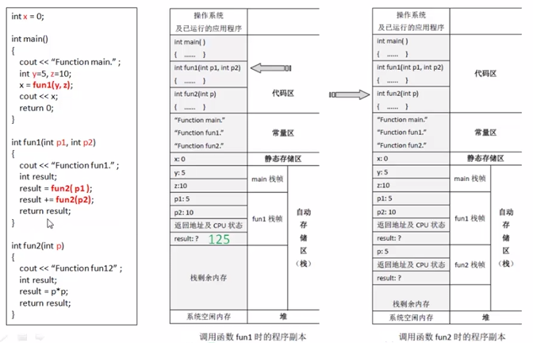
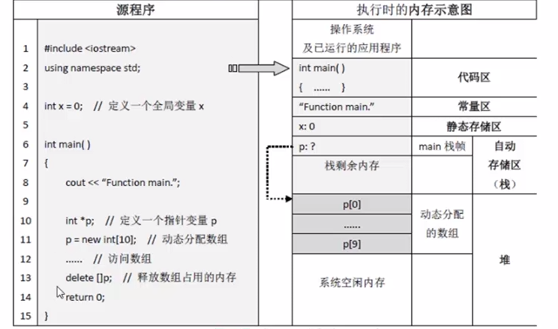
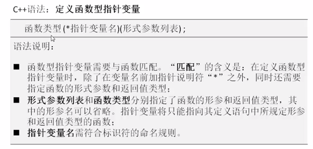
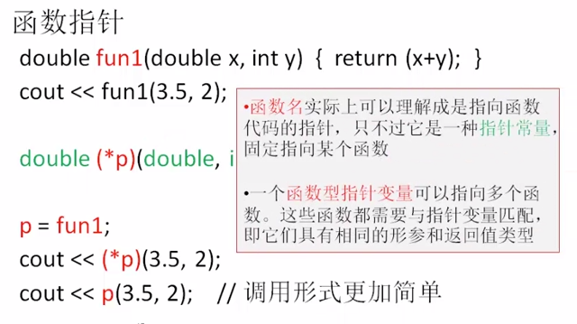

程序经过 **编译** 、 **链接**  会被翻译成等效的机器语言，即 **目标程序** 。 
平时
，目标程序是以可执行文件的形式保存在外存上的，执行时将被读入内存，在内存中建立程序的副本。 
操作系统可以被认为是计算机运行后第一个执行的程序，计算机运行期间，操作系统的程序副本一直停留在内存中。当用户执行某个程序时，操作系统见程序从外村读入内存，当程序运行结束退出时，程序占用的内存才会释放。 
计算机运行期间，操作系统负责管理、分配系统中未被占用的内存空间（堆：系统空闲内存）。 

计算机运行程序，操作系统会将可执行程序读入内存，建立程序副本，这个过程成为==加载程序==； 
加载后的程序副本在内存中会占有操作系统辟出的空间，内存空间按作用可被分为 **代码区** 、 **常量区** 、 **静态存储区** 、 **自动存储区（栈）** 
- 代码区：存放程序中的 **函数** 所对应的机器语言代码；
- 常量区：存放程序中的某些常量（const常量、字符串字面量……）；
- 静态存储区：存放程序中定义的全局变量，全局变量在程序加载后立即分配内存；
- 自动存储区（栈）：存放程序中定义的局部变量和函数形参，栈是由编译器为程序预留的内存空间，有大小限制。在程序刚刚被加载时，栈空间还是空的，程序执行过程中将自行为局部变量和函数形参分配空间；
	+ 当执行到函数调用语句时，被调函数的栈帧 ——
		- 函数形参；
		- 函数内定义的局部变量；
		- 函数（主调函数）返回地址及函数被调用前 CPU 的状态；
		- 返回值；
	+ 
 

+ 程序加载后将毅力为其中的 **全局变量** 分配内存。 ==全局变量==  将一直占用所分配的内存，直到程序运行结束退出时才被释放，这种内存分配方法称为 静态分配。
+ ==局部变量== 实在计算机执行到其定义语句时才分配内存，到其所在代码块执行结束即被释放，这种内存分配方法称为 自动分配。
	- 一个函数或复合语句可能被执行多次，随着这些函数或复合语句的执行，其中所定义的局部变量将不断重复内存的 分配-释放 的过程，这个过程是自动完成的，无需程序员干预；
	- 函数定义中的形参也是自动分配内存的，当执行到该函数的调用语句时为形参分配内存，并将传递来的实参值写入该内存，然后执行函数体，当函数体执行结束后释放内存；
	- 
+ 生存期
	- 从~~加载到执行结束退出~~这个时间段是一个==程序==在内存中的生存期；
	- 从~~内存分配到释放~~这个时间段是一个==变量==在内存中的生存期；
 

计算机执行函数调用语句的具体过程：
- 执行到函数调用语句时，暂停主调函数的执行，跳转去执行被调函数；
- 为被调函数定义的形参分配好内存，计算调用语句中的实参表达式，将表达式结果按位置顺序一一赋值给对应的形参；
- 保存好返回值地址和当前 CPU 的状态信息，即保存主调函数调用前的现场；
- 执行被调函数体；
- 执行完被调函数的函数体或执行到其中的 return 语句，停止被调函数的执行，如果有返回值，将返回值传回主调函数；
- 恢复主调函数调用前的现场，调用结束；
- 按照返回地址继续执行主调函数中剩余的指令；

**动态内存分配**
程序员可根据实际需要，在程序中使用 new 运算符来分配内存，使用完之后， 使用 delete 运算符将其释放。这种 **动态分配** 方法让程序员可以更主动、更直接地管理内存，根据需要分配尽可能少的内存，同时尽早释放以减少内存的占用时间。

动态分配的内存实在 ==系统空闲内存（堆）== 中分配内存的，所以需要程序员主动将其释放，否则可能在程序运行结束后仍然占用堆内存，造成内存泄漏。

**函数指针**
- 可以通过内存地址访问变量，也可以通过内存地址调用函数；
- 计算机程序在执行时被读入内存，在内存中建立一个程序副本，其中包含各函数的代码。即是说，执行时程序中各函数的代码是存放在内存中的；
- 调用函数一般是通过函数名来调用，也可以通过函数代码的首地址来调用；
- 通过地址调用函数需分为3步：
	1. 定义函数型指针变量
	2. 将函数首地址赋值给该指针变量
	3. 通过指针变量间接调用函数
	4. 
 

